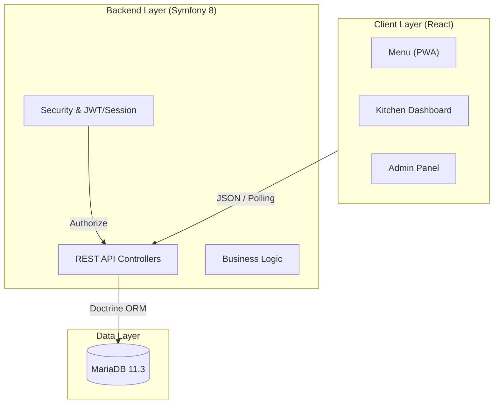

# 🍽️ Comanda Digital

[](https://symfony.com/)
[](https://reactjs.org/)
[](https://tailwindcss.com/)
[](https://www.docker.com/)

**Comanda Digital** is a modern Progressive Web App (PWA) designed to revolutionize restaurant order management. It bridges the gap between customers and the kitchen, providing a seamless, real-time experience that replaces static QR menus with an interactive ordering system.

---

## ✨ Key Features

### 📱 Customer Experience (Mobile-First)

- **Instant QR Access:** Scan and order directly without installing any app.
- **Interactive Menu:** Smooth navigation with category filtering and real-time search.
- **Smart Allergen Filter:** Dynamically hide products based on dietary requirements.
- **Multi-language Support:** Full translation in Spanish, English, and French.
- **Security PIN:** Protected table sessions to prevent order tampering.

### 🍳 Kitchen & Bar Optimization

- **Real-time Kanban:** Automated order dispatching to kitchen or bar stations.
- **Traffic Light System:** Visual wait-time indicators (Green 🟢, Yellow 🟡, Red 🔴).
- **Critical Alerts:** Visual highlights for allergens and special notes.
- **Status Management:** One-tap status updates from "Pending" to "Delivered".

### ⚙️ Management & Administration

- **Complete Dashboard:** Control products, categories, tables, and users.
- **Reservation System:** Full lifecycle management of table bookings.
- **automated Billing:** Instant tax-compliant ticket generation (IVA/VAT breakdown).
- **Sales Analytics:** Detailed reports and data export (CSV/Excel).

---

## 🏗️ Architecture



---

## 🚀 Quick Start

### Prerequisites

- **Docker** and **Docker Compose**
- **Git**

### Installation in 1 Step

```bash
# Clone the repository
git clone [URL]
cd TFG_bueno_real_2026_HD

# Start the project automatically
./Iniciar_proyecto.sh
```

The system will be ready in ~30 seconds.

### 🔗 Access URLs

| Section            | URL                            | Access                      |
| :----------------- | :----------------------------- | :-------------------------- |
| **Customer Menu**  | `http://localhost:8001`        | _Scan QR or select a table_ |
| **Kitchen Panel**  | `http://localhost:8001/cocina` | _Staff credentials_         |
| **Bar Panel**      | `http://localhost:8001/barra`  | _Staff credentials_         |
| **Administration** | `http://localhost:8001/admin`  | _Admin credentials_         |

---

## 🛠️ Development Tools

| Action                 | Command (inside /Backend)                              |
| :--------------------- | :----------------------------------------------------- |
| **Rebuild Containers** | `docker compose up -d --build`                         |
| **View App Logs**      | `docker logs -f symfony_app`                           |
| **Frontend Assets**    | `npm run watch` (or `dev`)                             |
| **Database Console**   | `docker exec -it backend-database-1 mariadb -u app -p` |

---

## 📂 Documentation

Detailed documentation can be found in the `/docs` directory:

- [Technical Specifications](file:///docs/especificaciones.md)
- [Design System](file:///docs/diseño.md)
- [API Reference](file:///docs/api_reference.md) _(Coming Soon)_
- [Database Schema](file:///docs/database_schema.md) _(Coming Soon)_

---

## 👤 Author

**Rubén** - Final Degree Project (TFG) 2026.
