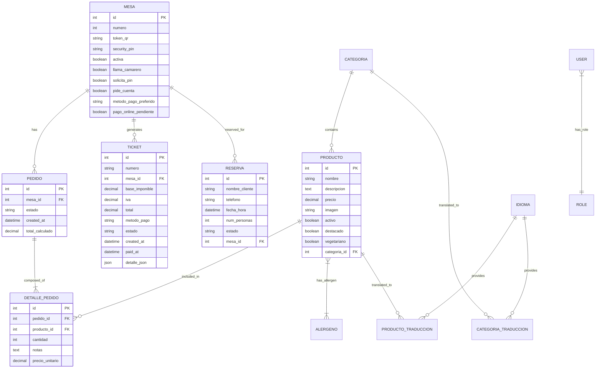

# Database Schema - Comanda Digital

This document describes the relational model and entities of the Comanda Digital system.

## 📊 Entity Relationship Diagram (Mermaid)

## 🔑 Core Entities Details

### 1. Mesa (Table)

The central entity for client interaction. It stores session states (`llama_camarero`, `pide_cuenta`) and security tokens. The `security_pin` is rotated every time a table is closed to ensure session isolation between different customers.

### 📜 DBML Schema

You can find the raw DBML code for [dbdiagram.io](https://dbdiagram.io) here:

- [dbdiagram.dbml](file:///home/usua5pc2/Escritorio/TFG_bueno_real_2026_HD/docs/dbdiagram.dbml) (Versión Básica)
- [dbdiagram_pro.dbml](file:///home/usua5pc2/Escritorio/TFG_bueno_real_2026_HD/docs/dbdiagram_pro.dbml) (Versión Pro - Notificaciones/Pagos/Gestión)

### 2. Pedido & DetallePedido (Order)

Orders are split by category type. Each `Pedido` represents a subset of items for either the Kitchen or the Bar. `DetallePedido` stores the snapshot of the price at the moment of ordering.

### 3. Producto & Categoria

Products are organized into categories. Categories have a `tipo` field (`cocina` or `barra`) which dictates where the orders are sent.

### 4. Ticket (Fiscal Invoice)

Stored as a historical record. Once a table is closed, a ticket is generated, and the associated `Pedido` records are cleared from the active view but preserved in the `detalle_json` column for audit trails.

### 5. Multi-language Tables

- **Idioma:** Stores supported languages (ISO codes, flags).
- **Traducciones:** Separate tables for `Producto` and `Categoria` titles/descriptions to keep the main entity index clean and performant.
