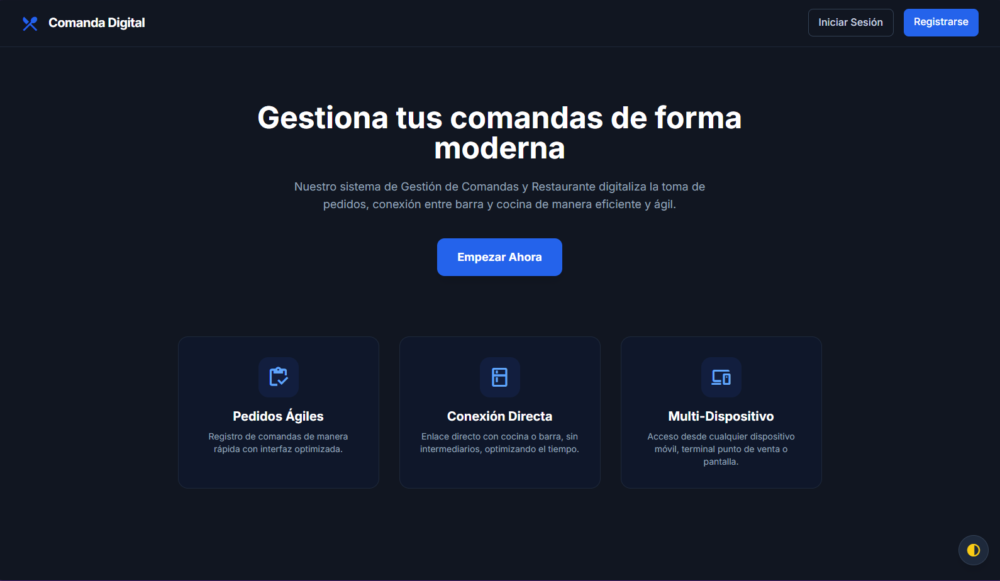
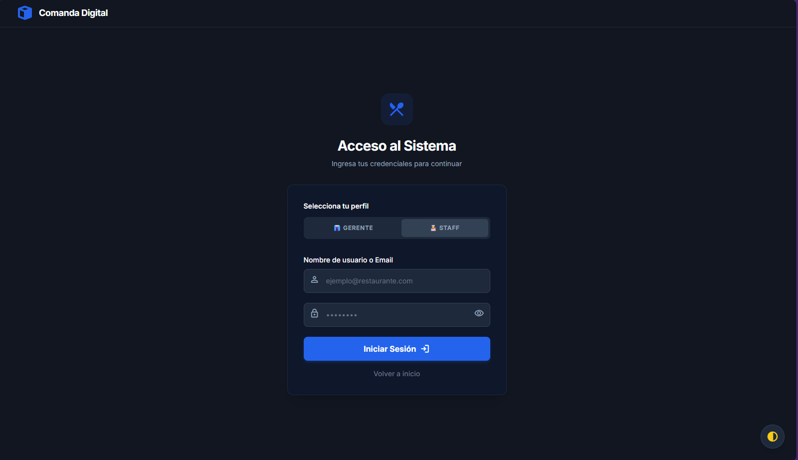
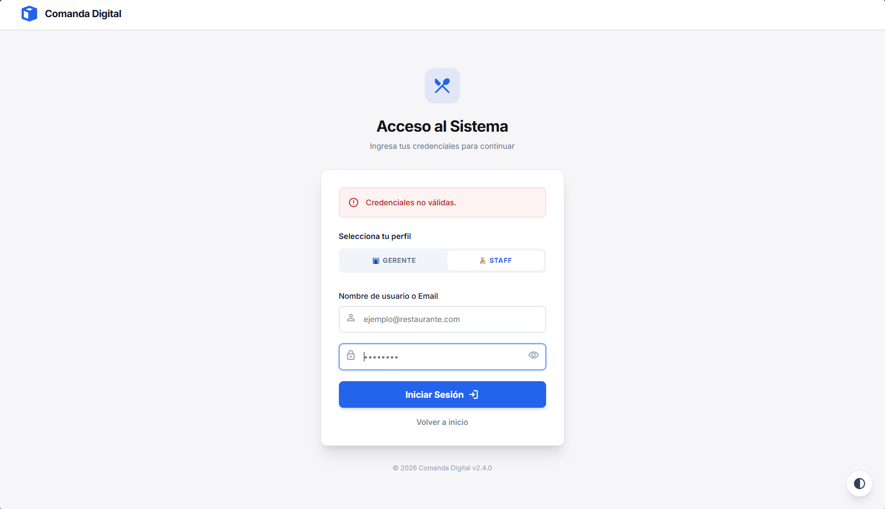
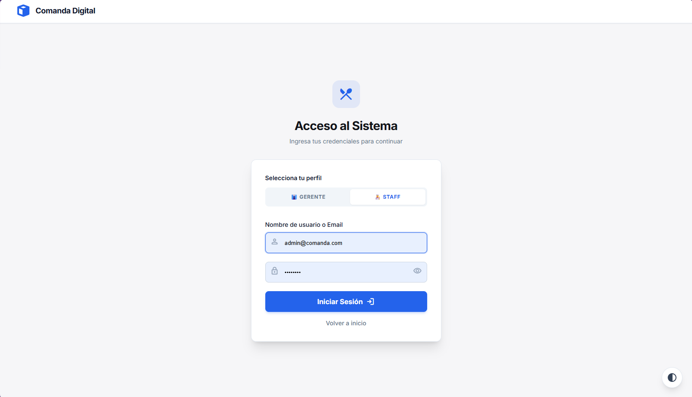
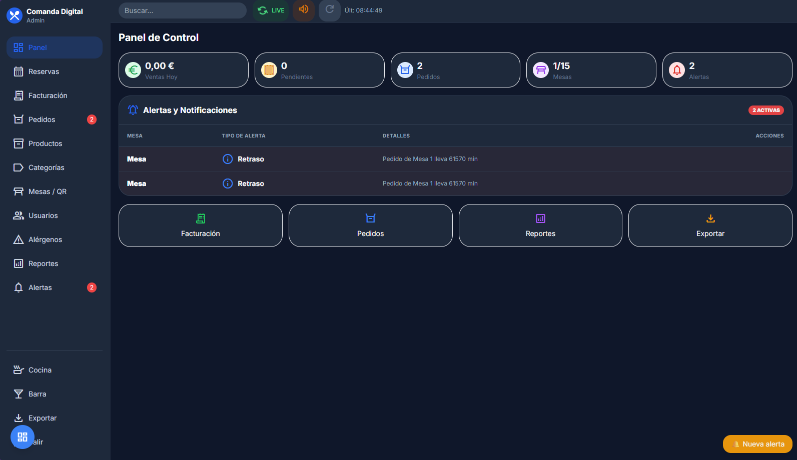
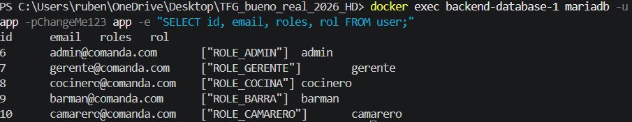

# Ejercicio de Entrega Parcial TFG: Modulo de Autenticacion
Autor: Ruben Corral Romero

## 1. Capturas de Pantalla

A continuacion incluyo las capturas de pantalla de las funcionalidades operativas:

**1. Pagina de Inicio (Home):**

**2. Formulario de Login (Vacio y con Error):**

 

**3. Formulario de Login (Relleno y Panel de Usuario):**

 

**4. Evidencia de Conexion con la Base de Datos:**

---

## 2. Descripcion Tecnica

Para montar el tema del login y todo eso en el TFG he usado Symfony y Doctrine como vimos en el seminario. Resumo un poco lo que he tenido que tocar:

**Entidades que he usado:**
He tirado de la entidad `User.php`. Le he puesto los atributos de ORM normales para que cree la tabla en la base de datos y le he metido las interfaces que te obliga Symfony para que el login funcione y las contraseñas no se guarden en texto plano. Tambien le he añadido un campo `rol` para que el sistema sepa separar si eres camarero, cocinero o gerente normal.

**Controladores y rutas:**
- `HomeController`: Esta es la ruta principal del proyecto (`/`). Antes la tenia puesta para que te mandara directo al login segun entrabas al puerto, pero la he cambiado para que te cargue una pagina de inicio chula (landing page) que he montado para que el proyecto quede mas profesional de cara a la entrega.
- `SecurityController`: Aqui es donde esta toda la chicha del login (`/login`) y para cerrar la sesion (`/logout`). Basicamente comprueba si pones mal la contraseña para escupirte un error (flash message), y si entras con los datos bien o ya estabas logueado de antes, intercepta la peticion y te manda directo a tu panel (`admin_panel` o `cocina_panel`) pillando tu rol.

**La plantilla base.html.twig y el diseño:**
He usado el archivo `base.html.twig` como esqueleto porque ahi le meto el Tailwind CSS para que el diseño no quede cutre. Luego las demas pantallas como la del login o la del inicio simplemente las extiendo usando el extends de Twig, asi no tengo que andar copiando y pegando todo el CSS en cada pantalla que haga y mantengo el diseño oscuro.

**Docker Compose y Base de Datos:**
La base de datos va por el docker-compose que monte con una imagen de Mariadb. Le meti las variables tipicas de user y password y conecte Symfony a esto cambiando el archivo `.env`. Asi con tirar los comandos de Doctrine ya se crearon las tablas donde van los usuarios.