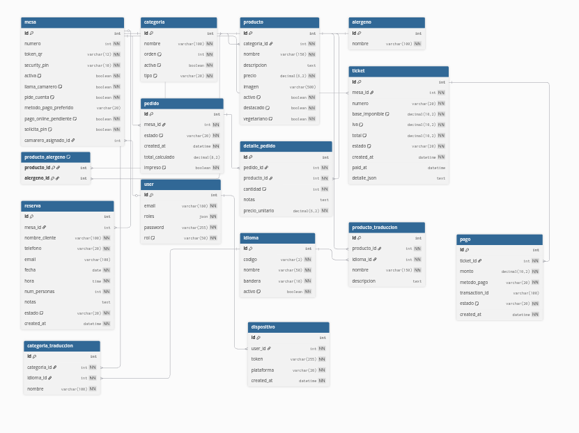

# 1. Introduccion

## 1.1. Contexto y Motivacion
La hosteleria ha sufrido una transformacion digital acelerada en los ultimos años. Sin embargo, la mayoria de soluciones adoptadas por pequeños y medianos restaurantes se limitan a digitalizar una carta fisica en un archivo PDF estatico accesible por codigo QR.

Esta solucion presenta graves problemas de **Experiencia de Usuario (UX)**: obliga al cliente a hacer zoom continuamente, no permite filtrar platos segun restricciones alimentarias y, lo mas critico, rompe el flujo de pedido, obligando al cliente a esperar a un camarero para tomar nota.

El presente proyecto, **"Comanda Digital"**, nace para solucionar esta desconexion. No se trata solo de mostrar el menu, sino de facilitar, automatizar y acelerar el proceso completo, desde que el cliente se sienta hasta que la comida llega a la mesa.

## 1.2. Objetivos del Proyecto

El objetivo principal es desarrollar una Aplicacion Web Progresiva (PWA) que elimine los cuellos de botella en el servicio de un restaurante.

**Objetivos Especificos:**
1.  **Eliminar el "PDF estatico":** Crear una interfaz interactiva donde el cliente pueda añadir productos al carrito directamente desde su movil.
2.  **Seguridad Alimentaria:** Implementar un sistema de filtrado dinamico de alergenos que oculte automaticamente los platos no aptos para el comensal.
3.  **Optimizacion de Cocina (Sistema Semaforo):** Desarrollar un sistema de gestion visual para el personal de cocina que alerte mediante codigos de color (Verde/Amarillo/Rojo) sobre el tiempo de espera de cada comanda.
4.  **Gestion de Cobro:** Automatizar el calculo de la cuenta por mesa, permitiendo al camarero cerrar la sesion con un solo clic y evitando errores manuales de suma.

---

# 2. Estado del Arte (Contexto Tecnologico)

Actualmente, existen soluciones en el mercado como *Square*, *GloriaFood* o los propios TPVs bancarios. Sin embargo, estas presentan barreras para el hostelero medio:
* **Coste:** Suelen requerir suscripciones mensuales elevadas o comisiones por pedido.
* **Hardware:** Muchas exigen comprar tablets o impresoras especificas.
* **Complejidad:** Incluyen funciones innecesarias (reparto a domicilio, gestion de stock compleja) que dificultan su uso diario.

Mi propuesta se diferencia por ser una solucion ligera, basada en tecnologias web estandar (no requiere instalar apps) y centrada especificamente en la **agilidad del servicio en sala** (Dine-in) y la comunicacion visual con cocina.
---
# Especificaciones Tecnicas: Comanda Digital

**Proyecto:** Trabajo de Fin de Grado (TFG)  
**Descripcion:** Sistema de comanda con desarrollo web y el sistema responsive para que se vea en movil.

## Tabla de contenido

- [1. Requisitos del Sistema](#1-requisitos-del-sistema)
  - [1.1 Requisitos Funcionales - Cliente](#11-modulo-cliente)
  - [1.2 Requisitos Funcionales - Cocina](#12-modulo-cocina-y-barra)
  - [1.3 Requisitos Funcionales - Administracion](#13-modulo-administracion)
  - [1.4 Requisitos No Funcionales](#14-requisitos-no-funcionales-rnf)
- [2. Stack Tecnologico](#2-stack-tecnologico)
- [3. Arquitectura y Diseño de Interfaces](#3-arquitectura-y-diseno-de-interfaces)
  - [3.1 Resumen Tecnico](#31-resumen-tecnico)
  - [3.2 Contrato de API (Endpoints)](#32-contrato-de-api)
  - [3.3 Flujo de Usuario](#33-flujo-de-usuario-happy-path)
- [4. Modelo de Datos](#4-modelo-de-datos)
- [5. Accesibilidad y Seguridad](#5-accesibilidad-y-seguridad)
- [6. Estrategia de Pruebas (QA)](#6-estrategia-de-pruebas-qa)
- [7. Anexos Visuales](#7-anexos-visuales)

---

## 1. Requisitos del Sistema

### 1.1 Modulo Cliente
**Objetivo:** Ofrecer una experiencia rapida ("Quick Order") y accesible para que los clientes consulten la carta y pidan desde la mesa sin instalar apps.

- **RF-01 — Acceso Directo QR:**
  - El sistema identificara la mesa automaticamente mediante el token en la URL del QR.
  - No requiere registro de usuario (login) para consultar y pedir.

- **RF-02 — Navegacion Vertical (Single Page):**
  - Toda la carta se carga en una unica vista.
  - Navegacion fluida por anclas (scroll suave) entre categorias (Entrantes, Bebidas, etc.).

- **RF-03 — Filtro Dinamico de Alergenos:**
  - Panel lateral o superior con iconos de alergenos (Gluten, Lactosa, etc.).
  - Al activar un filtro, los productos no aptos **desaparecen** visualmente de la lista.

- **RF-04 — Añadido Rapido (1-Click):**
  - Boton directo `[+]` en la tarjeta del producto para añadir 1 unidad al carrito sin abrir modales.

- **RF-05 — Carrito Flotante:**
  - Barra inferior persistente que muestra el total de items y precio.
  - Acceso directo a "Confirmar Pedido".

### 1.2 Modulo Cocina y Barra
**Objetivo:** Panel operativo de alto rendimiento (KDS) para gestionar el flujo de trabajo.

- **RF-06 — Tablero Kanban en Tiempo Real:**
  - Columnas: *Pendiente*, *En Preparacion*, *Listo*.
  - Los pedidos nuevos aparecen instantaneamente (WebSockets/Mercure) sin recargar la pagina.

- **RF-07 — Interaccion Tactil Rapida:**
  - Cambio de estado mediante "Drag & Drop" o un solo toque ("One-tap") en la tarjeta.

- **RF-08 — Semaforo de Prioridad (Gestion Visual):**
  - Las tarjetas cambian de color segun el tiempo de espera:
    - 🟢 **Verde:** Pedido reciente.
    - 🟡 **Amarillo:** Alerta de demora.
    - 🔴 **Rojo:** Critico/Retrasado.

- **RF-09 — Alertas Criticas:**
  - Resaltado visual evidente para notas de seguridad ("ALERGIA", "CELIACO").

- **RF-10 — Cierre de Mesa y Calculo Automatico:**
  - Boton "Pedir la Cuenta" que agrupa todos los pedidos de la sesion de una mesa.
  - Calculo automatico del total a pagar, eliminando errores manuales.

### 1.3 Modulo Administracion
**Objetivo:** Gestion del negocio y configuracion.

- **RF-11 — Gestion del Catalogo (CRUD):**
  - Alta, baja y modificacion de productos y categorias.
  - Asignacion obligatoria de alergenos mediante checkboxes.
  - Subida de imagenes optimizadas.

- **RF-12 — Generacion de QR:**
  - Generacion de codigos QR unicos asociados a cada ID de mesa.
  - Opcion de descarga en formato imprimible (PDF/PNG).

### 1.4 Requisitos No Funcionales (RNF)
Definen la calidad del servicio.

- **RNF-01 — Rendimiento:** La carga inicial de la carta (FCP) debe ser inferior a 2 segundos en redes 4G.
- **RNF-02 — Disponibilidad:** El sistema debe ser resiliente a micro-cortes de red en la cocina (reconexion automatica de WebSockets).
- **RNF-03 — Usabilidad:** Diseño *Mobile First* estricto, cumpliendo estandares de accesibilidad (tamaño de botones para dedos).
- **RNF-04 — Escalabilidad:** Arquitectura preparada para soportar picos de concurrencia (viernes/sabados noche).

---

## 2. Stack Tecnologico

Seleccion de herramientas basada en robustez, comunidad y rendimiento.

| Capa | Tecnologia / Herramienta | Justificacion |
|---|---|---|
| **Diseño** | Stitch IA | Prototipado UI/UX y definicion de Design System. |
| **Frontend** | **React** (con Symfony UX React) + **Tailwind CSS** | Interfaces modernas, reactivas y reutilizables integradas directamente en Symfony mediante el bundle UX React. |
| **Backend** | **Symfony 8** (PHP) | Framework MVC robusto, seguro y escalable. |
| **Gestor Paquetes** | **Composer** | Gestion de dependencias de PHP. |
| **Base de Datos** | **MariaDB** | Motor relacional fiable para integridad de datos. |
| **Infraestructura** | **Docker** & **Docker Compose** | Contenerizacion para entorno de desarrollo identico a produccion. |
| **Tiempo Real** | **Mercure** | Protocolo de notificaciones Push para el tablero de cocina. |
| **Control Versiones** | GitHub | Git Flow, Pull Requests y backup en la nube. |
| **IDE** | Visual Studio Code | Entorno ligero con extensiones para PHP/Symfony. |

---

## 3. Arquitectura y Diseño de Interfaces

### 3.1 Resumen Tecnico
El sistema sigue una arquitectura **Cliente-Servidor desacoplada** comunicada vía API REST, pero con integración avanzada entre Symfony y React.
- **Frontend:** SPA/PWA desarrollada en **React** e integrada en Symfony mediante **Symfony UX React**. Los componentes React pueden ser renderizados directamente desde Twig, permitiendo una experiencia de usuario moderna y altamente interactiva, gestionando los assets con **Webpack Encore** o **Vite** para hot-reload y optimización.
- **Backend:** API Platform / Symfony Controllers.

### 3.2 Contrato de API
Endpoints principales que expondra el Backend:

| Metodo | Endpoint | Descripcion |
| :--- | :--- | :--- |
| `GET` | `/api/mesa/{token}/carta` | Obtiene categorias y productos (filtrados por disponibilidad). |
| `POST` | `/api/pedido` | Recibe el carrito del cliente y lo guarda en BBDD. |
| `GET` | `/api/cocina/stream` | (Mercure) Suscripcion a eventos de nuevos pedidos. |
| `PATCH` | `/api/pedido/{id}/estado` | Cocina actualiza el estado (ej: Pendiente -> Listo). |
| `GET` | `/api/admin/mesa/{id}/cuenta` | Calcula el total de la mesa para el cobro. |

### 3.3 Flujo de Usuario (Happy Path)
1. **Cliente** escanea QR -> El Frontend carga la carta asociada a la mesa.
2. **Cliente** añade productos y confirma -> `POST /api/pedido`.
3. **Backend** valida, guarda y emite evento a Mercure Hub.
4. **Pantalla Cocina** recibe el evento -> Aparece tarjeta nueva (Sonido + Visual).
5. **Cocinero** pulsa la tarjeta -> Estado cambia a "En preparacion".

---

## 4. Modelo de Datos

El diseño de base de datos soporta la casuistica real del restaurante (basado en el menu de "Casa Encarni"), incluyendo descripciones complejas y precios por categoria.

**Entidades Principales:**

* **MESAS:** `id`, `numero`, `token_qr` (Identificador unico).
* **CATEGORIAS:** `id`, `nombre`, `descripcion` (ej: "Todas las pizzas 11€").
* **PRODUCTOS:** `id`, `nombre`, `descripcion` (Texto largo para ingredientes), `precio`, `activo`.
* **ALERGENOS:** `id`, `nombre`, `icono`.
* **PRODUCTO_ALERGENO:** Tabla intermedia (N:M) para filtrar la carta.
* **PEDIDOS:** `id`, `mesa_id`, `estado`, `created_at` (Vital para el semaforo de colores), `total_calculado`.
* **DETALLE_PEDIDO:** `id`, `pedido_id`, `producto_id`, `cantidad`, `notas` (ej: "Sin cebolla").

> *Nota: Ver diagrama Entidad-Relacion en la seccion de Anexos.*

---

## 5. Accesibilidad y Seguridad

- **Seguridad:**
  - Validacion estricta en Backend para evitar inyeccion de pedidos falsos.
  - Sanitizacion de inputs (notas de pedido) para evitar XSS.
  - Acceso a panel Admin protegido por firewall y autenticacion.
- **Accesibilidad:**
  - Contraste de colores verificado para el semaforo de cocina.
  - Botones con area tactil minima de 44x44px.

---

## 6. Estrategia de Pruebas (QA)

Se implementara una estrategia de testing para garantizar la estabilidad:

1.  **Pruebas Unitarias (PHPUnit):** Verificacion de la logica de negocio (ej: que el calculo total de la cuenta sea exacto, sumando suplementos).
2.  **Pruebas de Integracion:** Verificar que la API responde correctamente a las peticiones del Frontend.
3.  **Pruebas Manuales / User Acceptance Testing (UAT):** Validacion del flujo completo escaneando un QR real con un dispositivo movil.

---

## 7. Anexos Visuales

Las imagenes y diagramas tecnicos del proyecto.

### 7.1 Diagrama Entidad-Relacion (BBDD)
*(Insertar aqui la imagen exportada de dbdiagram.io)*

---

# 8. Conclusiones y Lineas Futuras

## 8.1. Conclusiones
El desarrollo del proyecto "Comanda Digital" ha permitido cumplir con los objetivos planteados, entregando una solucion funcional que mejora la experiencia en sala frente a las cartas tradicionales.

A nivel tecnico, la eleccion de una arquitectura desacoplada con **Symfony 7** en el backend y **React/Tailwind** en el frontend ha demostrado ser robusta. La implementacion de **Docker** ha facilitado enormemente el despliegue del entorno, y el uso de **Mercure** ha sido clave para lograr que el "semaforo de cocina" funcione en tiempo real sin saturar el servidor.

El sistema de filtrado de alergenos aporta un valor diferencial importante, alineandose con las normativas actuales de seguridad alimentaria y ofreciendo tranquilidad al cliente.