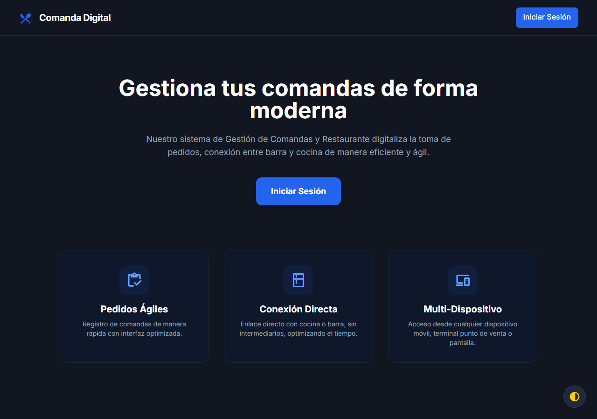
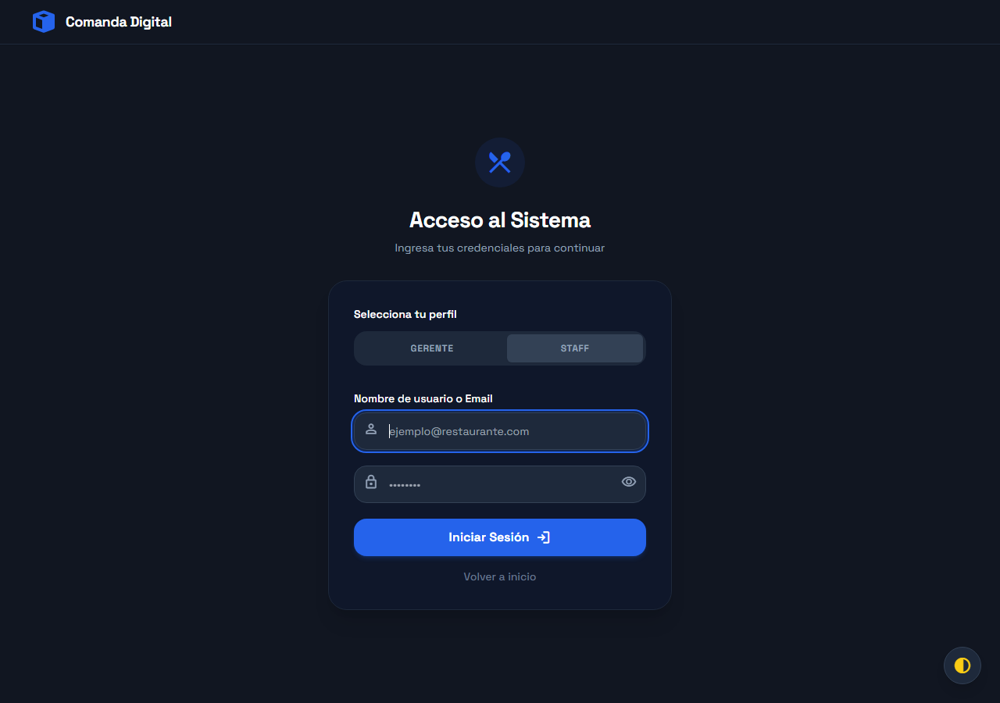
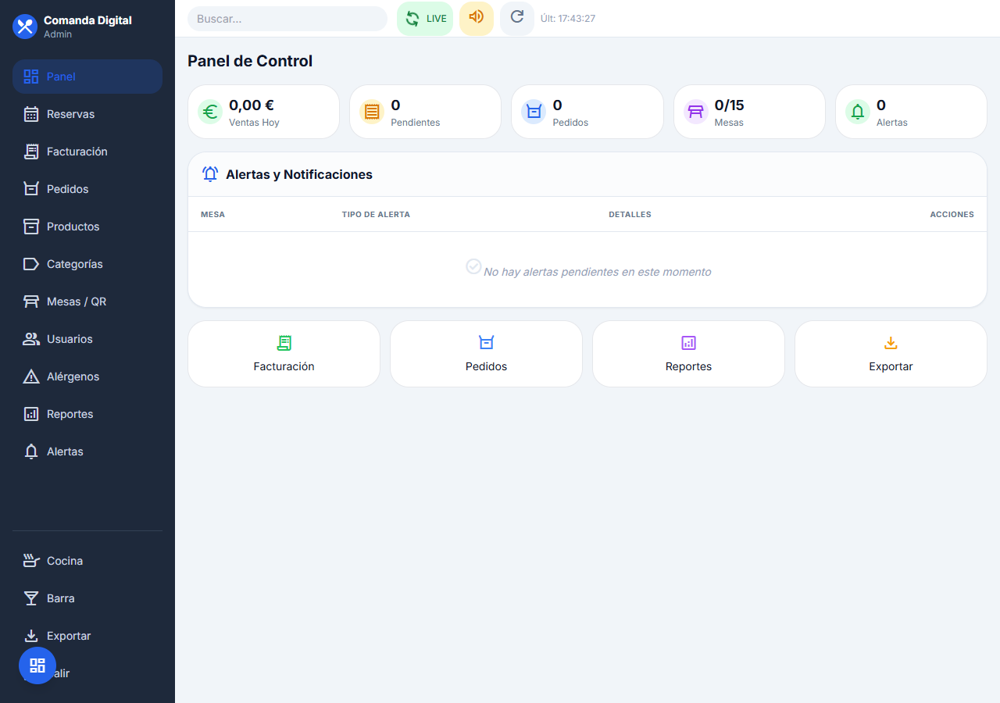
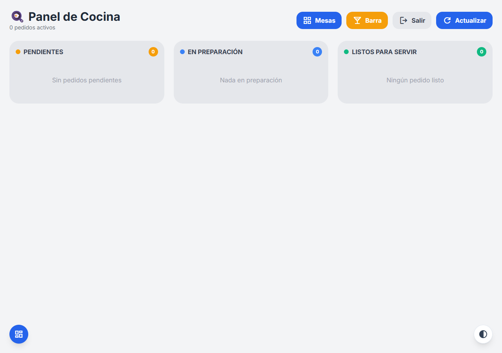
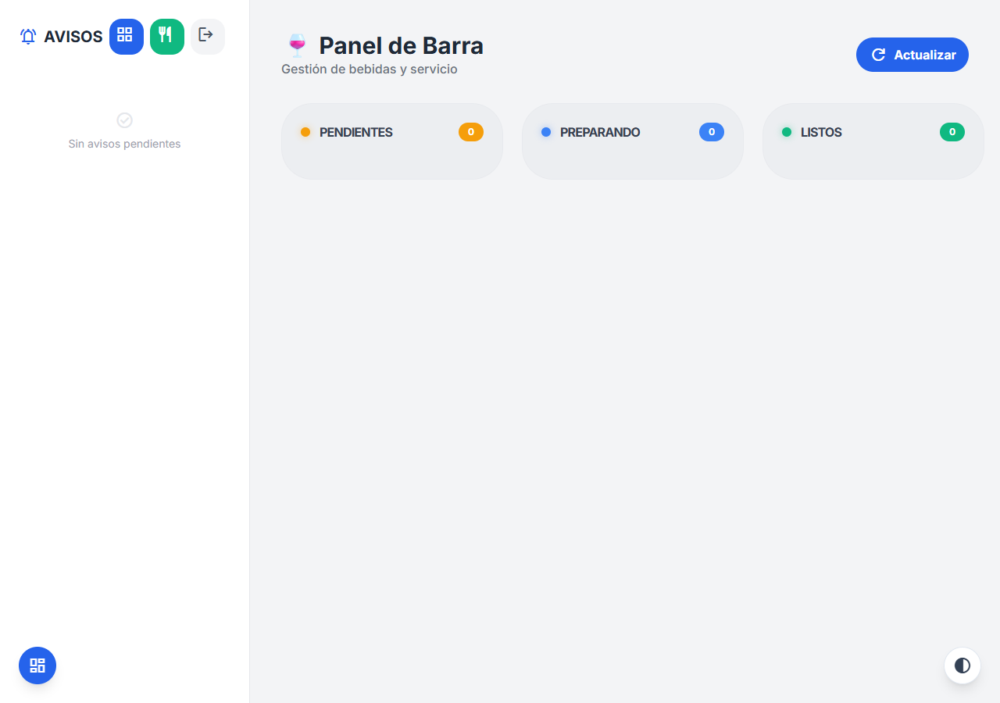
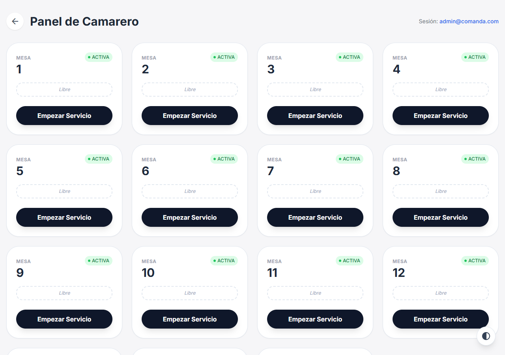
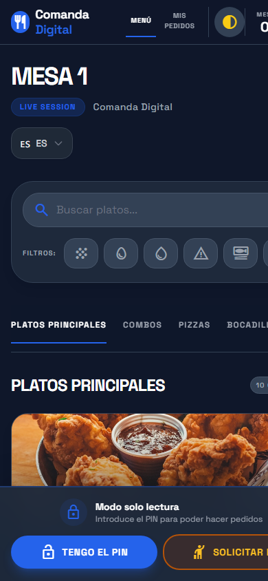

# Memoria Técnica del Proyecto
## Comanda Digital — Sistema de Gestión de Comandas para Restaurantes
### Trabajo de Fin de Grado · Ciclo Formativo de Grado Superior
**Autor:** Ruben  
**Fecha:** Mayo 2026

---

## Índice

1. [Descripción del Proyecto](#1-descripción-del-proyecto)
2. [Arquitectura del Sistema](#2-arquitectura-del-sistema)
3. [Modelo de Datos](#3-modelo-de-datos)
4. [Especificaciones Técnicas](#4-especificaciones-técnicas)
5. [Manual de Despliegue](#5-manual-de-despliegue)

---

## 1. Descripción del Proyecto

### 1.1 Contexto y Problema

La gestión de comandas en hostelería sigue siendo, en la mayoría de establecimientos, un proceso manual y propenso a errores: camareros anotando en papel, comunicación verbal con cocina y tiempos de espera difíciles de controlar. Las soluciones digitales existentes suelen consistir en cartas PDF estáticas accesibles por QR, que no resuelven el problema de comunicación entre sala, cocina y barra.

**Comanda Digital** nace para cubrir ese hueco: una aplicación web completa que digitaliza el ciclo completo del pedido, desde que el cliente escanea el QR de la mesa hasta que se genera el ticket de cobro.

### 1.2 Objetivos

| Objetivo | Descripción |
|---|---|
| Carta digital interactiva | El cliente añade productos al carrito desde su móvil, sin descargar ninguna app |
| Seguridad alimentaria | Filtrado dinámico por alérgenos que oculta productos no aptos |
| Comunicación en tiempo real | Los pedidos llegan automáticamente a cocina y barra mediante polling |
| Sistema semáforo | Indicador visual (verde/amarillo/rojo) según el tiempo de espera de cada pedido |
| Gestión de cobro | Cálculo automático de cuenta y generación de tickets con desglose de IVA |
| Panel de administración | CRUD completo de productos, mesas, usuarios y gestión de reservas |
| Seguridad por roles | Cada perfil de usuario accede únicamente a su área de trabajo |

### 1.3 Alcance del Sistema

El sistema cubre los siguientes módulos funcionales:

- **Módulo Cliente** — Carta digital accesible por QR, filtro de alérgenos, carrito, llamada al camarero y solicitud de cuenta
- **Módulo Cocina** — Panel Kanban con los pedidos de cocina, sistema semáforo y cambio de estado
- **Módulo Barra** — Panel equivalente para bebidas, gestión de notificaciones y cierre de mesas
- **Módulo Camarero** — Dashboard de mesas con sus estados y alertas activas
- **Módulo Administración** — Gestión de productos, categorías, alérgenos, mesas, usuarios, reservas, tickets y reportes

### 1.4 Público Objetivo

- **Cliente final** (sin formación técnica): accede por QR desde su móvil
- **Personal de cocina y barra**: usa tablets en su puesto de trabajo
- **Camareros**: acceden desde cualquier dispositivo
- **Gerencia / Administración**: panel web de escritorio para gestión y reportes

---

## 2. Arquitectura del Sistema

### 2.1 Diagrama de Arquitectura

```
┌───────────────────────────────────────────────────────────────┐
│                        CLIENTES                               │
│                                                               │
│  📱 Móvil (Cliente)   📋 Tablet (Cocina/Barra)  🖥 Desktop  │
│  Carta + Carrito      Kanban + Semáforo          Admin Panel  │
└──────────────────────────────┬────────────────────────────────┘
                               │  HTTP / HTTPS
                               ▼
┌───────────────────────────────────────────────────────────────┐
│               NGINX  (Contenedor Docker)                      │
│               Reverse Proxy — Puerto 8001                     │
└──────────────────────────────┬────────────────────────────────┘
                               │  FastCGI (PHP-FPM)
                               ▼
┌───────────────────────────────────────────────────────────────┐
│          SYMFONY 8 + PHP-FPM  (Contenedor Docker)            │
│                                                               │
│  ┌─────────────────────────────────────────────────────┐     │
│  │                   Controllers                        │     │
│  │  SecurityController  │  MesaController               │     │
│  │  PedidoController    │  BarraController              │     │
│  │  CocinaController    │  WaiterController             │     │
│  │  Admin/*Controller   │  HomeController               │     │
│  └─────────────────────────────────────────────────────┘     │
│                           │                                   │
│  ┌─────────────────────────────────────────────────────┐     │
│  │              Doctrine ORM (Repositories)             │     │
│  └─────────────────────────────────────────────────────┘     │
│                           │                                   │
│  ┌─────────────────────────────────────────────────────┐     │
│  │        Twig + React 18 (Webpack Encore)              │     │
│  │  Templates Twig → montan componentes React           │     │
│  └─────────────────────────────────────────────────────┘     │
└──────────────────────────────┬────────────────────────────────┘
                               │  TCP 3306
                               ▼
┌───────────────────────────────────────────────────────────────┐
│              MariaDB 11.3  (Contenedor Docker)                │
│              Puerto interno 3306                              │
└───────────────────────────────────────────────────────────────┘
```

### 2.2 Patrón MVC

El proyecto sigue el patrón **Modelo-Vista-Controlador** tal como lo implementa Symfony:

- **Modelo**: Entidades Doctrine en `src/Entity/` y repositorios en `src/Repository/`
- **Vista**: Plantillas Twig en `templates/` que montan componentes React mediante `{{ react_component() }}`
- **Controlador**: Clases en `src/Controller/` que reciben la petición HTTP, consultan el modelo y devuelven una respuesta (JSON o renderizado Twig)

### 2.3 Arquitectura Frontend

El frontend combina dos tecnologías complementarias:

- **Twig** gestiona el layout, la autenticación y el enrutado de páginas
- **React 18** gestiona las interfaces dinámicas (menú del cliente, paneles de cocina/barra, panel de administración) embebido en las plantillas Twig mediante Symfony UX React

Esta arquitectura permite aprovechar la seguridad y el enrutado de Symfony sin renunciar a la reactividad de React.

### 2.4 Flujo Principal de un Pedido

```
1. Cliente escanea QR → GET /mesa/{token}
2. Symfony identifica la mesa y sirve la carta
3. Cliente añade productos → carrito local en React
4. Cliente confirma → POST /api/pedido (JSON)
5. Symfony separa los items por tipo (cocina/barra)
   y crea un Pedido independiente para cada grupo
6. Cocina/Barra consultan → GET /api/cocina/pedidos (polling cada 10s)
7. Staff cambia estado → PATCH /api/pedido/{id}/estado
8. Cliente pide cuenta → POST /api/mesa/{token}/pagar
9. Barra cierra mesa → POST /api/barra/mesa/{id}/cerrar
   → Se genera Ticket con desglose de IVA y se limpia la mesa
```

---

## 3. Modelo de Datos

### 3.1 Diagrama Entidad-Relación

```
┌──────────────┐         ┌──────────────────┐         ┌──────────────────────┐
│     USER     │         │      PEDIDO      │ 1     N │   DETALLE_PEDIDO     │
├──────────────┤         ├──────────────────┤─────────├──────────────────────┤
│ PK id        │         │ PK id            │         │ PK id                │
│    email     │         │ FK mesa_id       │         │ FK pedido_id         │
│    password  │         │    estado        │         │ FK producto_id       │
│    roles[]   │         │    createdAt     │         │    cantidad          │
│    rol       │         │    totalCalculado│         │    notas             │
└──────────────┘         │    impreso       │         │    precioUnitario    │
                         └──────────────────┘         └──────────────────────┘
                                  │ N                            │ N
                                  │                              │ 1
                                 1│                              │
┌──────────────┐         ┌──────────────────┐         ┌──────────────────────┐
│    TICKET    │    N    │       MESA       │    1    │      PRODUCTO        │
├──────────────┤─────────├──────────────────┤         ├──────────────────────┤
│ PK id        │         │ PK id            │         │ PK id                │
│    numero    │         │    numero        │         │    nombre            │
│ FK mesa_id   │         │    tokenQr       │         │    descripcion       │
│    baseImp.  │         │    securityPin   │         │    precio            │
│    iva       │         │    activa        │         │    imagen            │
│    total     │         │    llamaCamarero │         │    activo            │
│    metodoPago│         │    pideCuenta    │         │    destacado         │
│    estado    │         │    metodo.Pago   │         │    vegetariano       │
│    createdAt │         │    pagoOnline.   │         │ FK categoria_id      │
│    paidAt    │         │    solicitaPin   │         └──────────────────────┘
│    detalle.  │         │    lastLlamarAt  │                   │ N
│    ticketR.Id│         │    lastPedirC.At │                   │ M
└──────────────┘         └──────────────────┘         ┌──────────────────────┐
       │ 1                        │ N                  │      ALERGENO        │
       │                          │                    ├──────────────────────┤
       │ N                        │ 1                  │ PK id                │
┌──────────────┐         ┌──────────────────┐         │    nombre            │
│     PAGO     │         │     RESERVA      │         └──────────────────────┘
├──────────────┤         ├──────────────────┤
│ PK id        │         │ PK id            │         ┌──────────────────────┐
│ FK ticket_id │         │    nombreCliente │         │     CATEGORIA        │
│    importe   │         │    telefono      │         ├──────────────────────┤
│    metodo    │         │    email         │         │ PK id                │
│    createdAt │         │    fecha         │         │    nombre            │
└──────────────┘         │    hora          │         │    orden             │
                         │    numPersonas   │         │    activa            │
                         │    notas         │         │    tipo (cocina|barra│
                         │    estado        │         └──────────────────────┘
                         │ FK mesa_id       │
                         │    createdAt     │
                         │    updatedAt     │
                         └──────────────────┘
```

**Relaciones principales:**
- `Mesa` → `Pedido` (1:N) — Una mesa puede tener muchos pedidos activos
- `Mesa` → `Ticket` (1:N) — Una mesa genera tickets al cerrar
- `Mesa` → `Reserva` (1:N) — Una mesa puede tener reservas asignadas
- `Pedido` → `DetallePedido` (1:N) — Un pedido tiene múltiples líneas
- `DetallePedido` → `Producto` (N:1) — Cada línea referencia un producto
- `Producto` → `Categoria` (N:1) — Todo producto pertenece a una categoría
- `Producto` ↔ `Alergeno` (N:M) — Tabla intermedia `producto_alergeno`
- `Ticket` → `Pago` (1:N) — Un ticket puede tener múltiples pagos parciales

### 3.2 Diccionario de Datos

#### Mesa

| Campo | Tipo | Descripción |
|---|---|---|
| `id` | INT PK | Identificador único |
| `numero` | INT | Número visible de la mesa |
| `tokenQr` | VARCHAR(12) | Token aleatorio incluido en la URL del QR |
| `securityPin` | VARCHAR(10) | PIN de 8 dígitos que valida la sesión del cliente |
| `activa` | BOOLEAN | Si la mesa está disponible para pedidos |
| `llamaCamarero` | BOOLEAN | El cliente ha pulsado "llamar al camarero" |
| `pideCuenta` | BOOLEAN | El cliente ha solicitado la cuenta |
| `solicitaPin` | BOOLEAN | El cliente solicita que le den el PIN en mesa |
| `metodoPagoPreferido` | VARCHAR(20) | Método de pago elegido por el cliente (efectivo/tarjeta/online) |
| `pagoOnlinePendiente` | BOOLEAN | Hay un pago online pendiente de confirmación por gerencia |
| `lastLlamarAt` | DATETIME | Control de rate limiting para llamadas al camarero |
| `lastPedirCuentaAt` | DATETIME | Control de rate limiting para solicitudes de cuenta |
| `camareroAsignado` | FK User | Camarero asignado a la mesa |

#### Pedido

| Campo | Tipo | Descripción |
|---|---|---|
| `id` | INT PK | Identificador único |
| `mesa_id` | FK Mesa | Mesa que realizó el pedido |
| `estado` | VARCHAR(20) | `pendiente` / `en_preparacion` / `listo` / `entregado` |
| `createdAt` | DATETIME | Fecha y hora de creación (base del semáforo) |
| `totalCalculado` | DECIMAL(8,2) | Total calculado a partir de los detalles |
| `impreso` | BOOLEAN | Si el pedido ha sido impreso |

#### DetallePedido

| Campo | Tipo | Descripción |
|---|---|---|
| `id` | INT PK | Identificador único |
| `pedido_id` | FK Pedido | Pedido al que pertenece |
| `producto_id` | FK Producto | Producto pedido |
| `cantidad` | INT | Número de unidades |
| `notas` | TEXT | Notas del cliente (alergias, preferencias) |
| `precioUnitario` | DECIMAL(6,2) | Precio en el momento del pedido (snapshot) |

#### Producto

| Campo | Tipo | Descripción |
|---|---|---|
| `id` | INT PK | Identificador único |
| `nombre` | VARCHAR(150) | Nombre del producto |
| `descripcion` | TEXT | Descripción detallada |
| `precio` | DECIMAL(6,2) | Precio de venta |
| `imagen` | VARCHAR(500) | URL de la imagen |
| `activo` | BOOLEAN | Si el producto aparece en la carta |
| `destacado` | BOOLEAN | Aparece en la sección de destacados |
| `vegetariano` | BOOLEAN | Apto para vegetarianos |
| `categoria_id` | FK Categoria | Categoría a la que pertenece |

#### Categoria

| Campo | Tipo | Descripción |
|---|---|---|
| `id` | INT PK | Identificador único |
| `nombre` | VARCHAR(100) | Nombre de la categoría |
| `orden` | INT | Orden de aparición en la carta |
| `activa` | BOOLEAN | Si la categoría es visible |
| `tipo` | VARCHAR(20) | `cocina` (va al panel de cocina) o `barra` (va al panel de barra) |

#### Ticket

| Campo | Tipo | Descripción |
|---|---|---|
| `id` | INT PK | Identificador único |
| `numero` | VARCHAR(20) UNIQUE | Número correlativo formato `YYYY-NNNN` |
| `mesa_id` | FK Mesa | Mesa que generó el ticket |
| `baseImponible` | DECIMAL(10,2) | Base imponible (total / 1.10) |
| `iva` | DECIMAL(10,2) | Cuota de IVA (10% restauración) |
| `total` | DECIMAL(10,2) | Total con IVA |
| `metodoPago` | VARCHAR(20) | `efectivo` / `tarjeta` / `tpv` / `online` |
| `estado` | VARCHAR(20) | `pendiente` / `pagado` / `anulado` |
| `createdAt` | DATETIME | Fecha de generación |
| `paidAt` | DATETIME | Fecha de cobro |
| `detalleJson` | TEXT | Snapshot JSON de los productos del pedido |

#### Reserva

| Campo | Tipo | Descripción |
|---|---|---|
| `id` | INT PK | Identificador único |
| `nombreCliente` | VARCHAR(100) | Nombre del cliente |
| `telefono` | VARCHAR(20) | Teléfono de contacto |
| `email` | VARCHAR(100) | Email (opcional) |
| `fecha` | DATE | Fecha de la reserva |
| `hora` | TIME | Hora de la reserva |
| `numPersonas` | INT | Número de comensales |
| `notas` | TEXT | Observaciones (alergias, preferencias) |
| `estado` | VARCHAR(20) | `pendiente` / `confirmada` / `cancelada` / `completada` / `no_show` |
| `mesa_id` | FK Mesa | Mesa asignada (opcional) |

#### User

| Campo | Tipo | Descripción |
|---|---|---|
| `id` | INT PK | Identificador único |
| `email` | VARCHAR(180) UNIQUE | Email (usado como identificador de login) |
| `password` | VARCHAR(255) | Contraseña hasheada con Argon2/Bcrypt |
| `roles` | JSON | Array de roles Symfony (`ROLE_ADMIN`, etc.) |
| `rol` | VARCHAR(50) | Rol legible (`admin`, `gerente`, `cocinero`, `barman`, `camarero`) |

### 3.3 Estados y Transiciones

**Estado del Pedido:**
```
pendiente ──► en_preparacion ──► listo ──► entregado
```

**Estado del Ticket:**
```
pendiente ──► pagado
          └─► anulado
```

**Estado de la Reserva:**
```
pendiente ──► confirmada ──► completada
          └─► cancelada
          └─► no_show
```

---

## 4. Especificaciones Técnicas

### 4.1 Tecnologías y Justificación

| Capa | Tecnología | Versión | Justificación |
|---|---|---|---|
| **Backend** | Symfony | 8.0 | Framework PHP empresarial con excelente soporte de seguridad, ORM y enrutado |
| **ORM** | Doctrine | 3.x | Mapeo objeto-relacional estándar del ecosistema Symfony |
| **Frontend reactivo** | React | 18 | Componentes reutilizables con estado local; integrado via Symfony UX React |
| **Plantillas** | Twig | 3.x | Motor de plantillas nativo de Symfony; gestiona layout y autenticación |
| **Estilos** | Tailwind CSS | 3.x | Utilidades CSS Mobile First; sistema de diseño consistente |
| **Bundler** | Webpack Encore | 4.x | Compilación de assets JavaScript/CSS integrada con Symfony |
| **Base de datos** | MariaDB | 11.3 | RDBMS open source compatible con MySQL; soporte de transacciones ACID |
| **Servidor web** | Nginx | Alpine | Proxy inverso de alto rendimiento; sirve estáticos directamente |
| **Contenedores** | Docker + Compose | Latest | Garantiza entorno reproducible en cualquier máquina |
| **Lenguaje** | PHP | 8.3+ | Última versión estable con tipos declarativos y rendimiento mejorado |

### 4.2 Justificación de Decisiones Clave

**¿Por qué React embebido en Twig?**  
La arquitectura híbrida permite mantener la seguridad, el enrutado y la autenticación de Symfony (probadas y robustas) mientras se obtiene la reactividad de React para las interfaces dinámicas. Alternativas como una SPA pura habrían requerido gestionar la autenticación desde el frontend, añadiendo complejidad y superficie de ataque.

**¿Por qué separar pedidos por tipo (cocina/barra)?**  
Un pedido del cliente puede contener tanto comida como bebidas. Si llegara como un único pedido, cocina y barra tendrían que filtrar los items ajenos. Separarlo en pedidos independientes simplifica la lógica de cada panel y permite estados independientes (cocina puede tener el plato en preparación mientras barra ya entregó la bebida).

**¿Por qué MariaDB en lugar de PostgreSQL?**  
El ecosistema Symfony/Doctrine funciona perfectamente con ambos. Se eligió MariaDB por su mayor compatibilidad con entornos de hosting compartido y su imagen Docker oficial con healthcheck integrado.

**¿Por qué polling cada 10 segundos en lugar de WebSockets?**  
Para un MVP el polling es más simple de implementar, más predecible en depuración y no requiere infraestructura adicional (servidor Mercure). La latencia de 10 segundos es aceptable en el contexto de un restaurante. La migración a WebSockets está identificada como trabajo futuro.

### 4.3 Seguridad Implementada

| Mecanismo | Implementación |
|---|---|
| Autenticación | Formulario de login con `AppCustomAuthenticator`, CSRF token |
| Contraseñas | Hashing automático con Argon2/Bcrypt via `UserPasswordHasherInterface` |
| Autorización | `access_control` en `security.yaml` + comprobaciones `isGranted()` en controllers |
| Jerarquía de roles | `ROLE_ADMIN > ROLE_GERENTE > ROLE_COCINA, ROLE_BARRA, ROLE_CAMARERO` |
| PIN de mesa | PIN de 8 dígitos aleatorio; validado en cada pedido; regenerado al cerrar mesa |
| Rate limiting | 10s entre pedidos (sesión), 30s entre llamadas al camarero (persistido en BD) |
| XSS | `htmlspecialchars(strip_tags())` en notas de pedido |
| SQL Injection | Doctrine ORM con prepared statements en todas las consultas |
| Validación de volumen | Máximo 20 unidades por producto, máximo 50 artículos por pedido |

### 4.4 Estructura del Proyecto

```
Backend/
├── src/
│   ├── Controller/
│   │   ├── Admin/              # CRUD administración (8 controllers)
│   │   ├── BarraController.php
│   │   ├── CocinaController.php
│   │   ├── MesaController.php
│   │   ├── PedidoController.php
│   │   ├── SecurityController.php
│   │   └── WaiterController.php
│   ├── Entity/                 # 11 entidades Doctrine
│   ├── Repository/             # Repositorios con queries personalizadas
│   ├── Security/               # AppCustomAuthenticator
│   └── DataFixtures/           # Datos de demostración
├── assets/
│   └── react/
│       └── controllers/
│           ├── admin/          # AdminPage.jsx
│           ├── barra/          # BarraPage.jsx
│           ├── cocina/         # CocinaPage.jsx
│           └── menu/           # 9 componentes (MenuPage, CartFloat, ProductCard…)
├── templates/                  # Plantillas Twig por módulo
├── config/                     # Configuración Symfony
├── migrations/                 # 11 migraciones de BD
├── docker/nginx/               # Configuración Nginx
├── Dockerfile
├── compose.yaml
├── docker-entrypoint.sh
└── public/                     # Punto de entrada (index.php) y assets compilados
```

### 4.5 Dependencias Principales

**PHP (composer.json):**
- `symfony/framework-bundle` 8.0 — núcleo del framework
- `symfony/security-bundle` 8.0 — autenticación y autorización
- `doctrine/orm` 3.x — mapeo objeto-relacional
- `symfony/ux-react` 2.x — integración React en Twig
- `symfony/webpack-encore-bundle` — gestión de assets
- `twig/twig` 3.x — motor de plantillas

**JavaScript (package.json):**
- `react` 18 + `react-dom` 18
- `tailwindcss` 3.x
- `@symfony/webpack-encore`

---

## 5. Manual de Despliegue

### 5.1 Requisitos Previos

- Docker Desktop instalado (versión 24+)
- Docker Compose incluido en la instalación
- Puerto 8001 libre en la máquina host

### 5.2 Pasos de Despliegue

**Paso 1 — Clonar el repositorio**
```bash
git clone <url-repositorio>
cd TFG_bueno_real_2026_HD/Backend
```

**Paso 2 — Levantar los contenedores**
```bash
docker compose up -d
```

Este comando levanta automáticamente tres servicios:
- `database` — MariaDB 11.3 (espera a estar lista antes de continuar)
- `app` — PHP-FPM con Symfony
- `web` — Nginx en el puerto 8001

**Paso 3 — Verificar el arranque automático**

El script `docker-entrypoint.sh` se ejecuta al arrancar el contenedor `app` y realiza automáticamente:
1. Espera a que MariaDB esté disponible (hasta 30 intentos)
2. Instala dependencias Composer si no existen
3. Aplica el esquema de base de datos (`doctrine:schema:update --force`)
4. Si la BD está vacía, carga los datos de demo (`doctrine:fixtures:load`)
5. Calienta la caché de producción (`cache:warmup`)

**Paso 4 — Acceder a la aplicación**

| URL | Descripción |
|---|---|
| `http://localhost:8001` | Página de inicio |
| `http://localhost:8001/login` | Login del sistema |
| `http://localhost:8001/admin` | Panel de administración |
| `http://localhost:8001/cocina` | Panel de cocina |
| `http://localhost:8001/barra` | Panel de barra |

### 5.3 Usuarios de Demo (cargados por fixtures)

| Email | Contraseña | Rol |
|---|---|---|
| `admin@comanda.com` | `admin123` | Administrador |
| `gerente@comanda.com` | `gerente123` | Gerente |
| `cocinero@comanda.com` | `cocina123` | Cocinero |
| `barman@comanda.com` | `barra123` | Barman |
| `camarero@comanda.com` | `camarero123` | Camarero |

### 5.4 Datos de Demo

Los fixtures cargan automáticamente:
- **7 alérgenos**: Gluten, Lactosa, Huevo, Pescado, Marisco, Frutos Secos, Soja
- **6 categorías**: Platos Principales, Combos, Pizzas, Bocadillos, Hamburguesas, Bebidas
- **~35 productos** con precios, descripciones e imágenes
- **15 mesas** numeradas del 1 al 15 con QR y PIN generados automáticamente

### 5.5 Comandos Útiles

```bash
# Ver logs del contenedor de la aplicación
docker compose logs -f app

# Acceder al contenedor de PHP
docker compose exec app bash

# Ejecutar migraciones manualmente
docker compose exec app php bin/console doctrine:migrations:migrate

# Recargar fixtures (borra y recarga todos los datos)
docker compose exec app php bin/console doctrine:fixtures:load --no-interaction

# Limpiar caché
docker compose exec app php bin/console cache:clear

# Parar todos los contenedores
docker compose down

# Parar y eliminar volúmenes (reseteo total)
docker compose down -v
```

### 5.6 Solución de Problemas

**La aplicación no responde en puerto 8001:**
```bash
docker compose ps          # Verificar que los tres contenedores están "Up"
docker compose logs web    # Revisar logs de Nginx
docker compose logs app    # Revisar logs de PHP-FPM
```

**Error de conexión a la base de datos:**
```bash
docker compose logs database    # Ver estado de MariaDB
docker compose restart app      # Reiniciar app (el entrypoint reintentará la conexión)
```

**Caché desactualizada tras cambios:**
```bash
docker compose exec app php bin/console cache:clear
```

---

## 6. Interfaz del Sistema

### 6.1 Página de Inicio



*Pantalla de bienvenida accesible públicamente, con acceso al sistema y descripción de funcionalidades.*

### 6.2 Formulario de Login



*Formulario de autenticación con selector de perfil (Gerente / Staff), CSRF token y hashing de contraseñas con Argon2.*

### 6.3 Panel de Administración



*Dashboard principal del administrador con métricas en tiempo real: ventas del día, pedidos pendientes, mesas activas y alertas. Sidebar con acceso a todos los módulos de gestión.*

### 6.4 Panel de Cocina



*Panel Kanban para el personal de cocina. Los pedidos se organizan en tres columnas según su estado (Pendiente → En Preparación → Listo). El sistema semáforo cambia de color (verde/amarillo/rojo) según el tiempo de espera.*

### 6.5 Panel de Barra



*Panel equivalente al de cocina, dedicado a la gestión de bebidas y productos de barra. Incluye sistema de avisos para llamadas de camarero y solicitudes de cuenta.*

### 6.6 Panel de Camarero



*Vista de las 15 mesas del restaurante con su estado en tiempo real. El camarero puede iniciar servicio en una mesa, ver alertas activas y gestionar el cobro.*

### 6.7 Carta Digital del Cliente (Vista Móvil)



*Interfaz accesible por QR desde cualquier móvil sin instalación. Muestra la carta con filtros de alérgenos, buscador, selector de idioma y carrito flotante. El banner inferior solicita el PIN de mesa para activar los pedidos.*

---

*Memoria Técnica generada para la defensa del TFG — Mayo 2026*